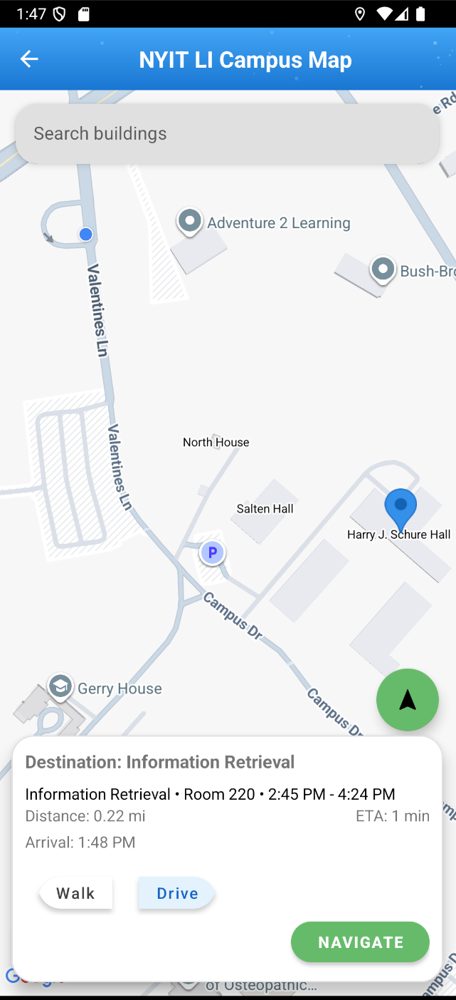

## My Contribution (Rushil Shanmugam)
For this team-based senior project, I developed the interactive campus map feature, including:
- Custom building and course-location markers
- Search behavior and route preview
- Graph-based campus navigation using OpenStreetMap-derived paths
- Shortest-path routing (Dijkstra) over custom node/edge structures
- Navigation refinements such as rerouting, location interaction, and camera behavior

### Demo (Map Feature) Click the picture to view a demo

[Watch the map demo video](assets/attendease-map-demo.mp4)

Demo shows route preview + navigation behavior for NYIT campus locations.

### Key Files (Map Feature)
- [CampusMapFragment.kt](https://github.com/MrRushy/AttendEase-SeniorProject/blob/master/app/src/main/java/com/example/attendeasecampuscompanion/map/CampusMapFragment.kt) — main map UI/interaction logic  
- [MapActivity.kt](https://github.com/MrRushy/AttendEase-SeniorProject/blob/master/app/src/main/java/com/example/attendeasecampuscompanion/map/MapActivity.kt) — map activity entry and coordination  
- [CampusGraph.kt](https://github.com/MrRushy/AttendEase-SeniorProject/blob/master/app/src/main/java/com/example/attendeasecampuscompanion/map/CampusGraph.kt) — campus graph + routing/path logic  
- [ClassBuildingLocation.kt](https://github.com/MrRushy/AttendEase-SeniorProject/blob/master/app/src/main/java/com/example/attendeasecampuscompanion/map/ClassBuildingLocation.kt) — course/building location mapping support  

### Supporting Notes
- Map integration points (e.g., navigation from other screens into the map) were team-owned and involved collaboration across the codebase.
- A small Python script was used during development to pull/transform path data, but it is not included in this repo because the processed data is already stored within the project.

# AttendEase - Campus Companion

AttendEase is a mobile attendance and campus life application for Android built with Kotlin. Designed for university environments, AttendEase streamlines attendance tracking, course management, and student-professor interactions through a unified platform.

## Overview

AttendEase serves two primary user types: **Professors** and **Students**. Professors can manage courses, track attendance, and communicate with students. Students can view their schedules, check into classes, and connect with peers through a built-in social platform.

The app integrates Firebase Authentication and Firestore for real-time data synchronization, Google Maps for campus navigation, and NFC technology for contactless attendance check-in.

---

## Features

### Professor Features

| Feature | Description |
|---------|-------------|
| **View Courses** | Browse all assigned courses with enrolled student rosters |
| **My Schedule** | Calendar view with daily class schedule, create events |
| **Mark Attendance** | Manual attendance marking with Present/Late/Absent options |
| **Attendance Reports** | Visual analytics with pie charts, bar charts, and per-student statistics |
| **Announcements** | Post announcements to specific courses |
| **Event Creation** | Schedule events with date, time, and location |

### Student Features

| Feature | Description |
|---------|-------------|
| **My Courses** | View enrolled courses with professor info, schedule, and announcements |
| **My Schedule** | Calendar view showing classes, finals, and events |
| **Next Class Display** | Homepage shows upcoming class with time and location |
| **View Announcements** | Read course announcements from professors |
| **Campus Map** | Interactive map with building locations and navigation |
| **NFC Check-In** | Contactless attendance via NFC tap |

### Social Features (SocialEase)

| Feature | Description |
|---------|-------------|
| **Explore Feed** | View and create posts, like and comment |
| **Friend System** | Send/accept friend requests, manage friends list |
| **Direct Messaging** | Real-time chat with friends/classmates |
| **User Profiles** | Customizable profiles with bio, major, and privacy settings |
| **Notifications** | Alerts for friend requests, likes, and comments |

---

## Tech Stack

- **Language:** Kotlin, Python
- **Platform:** Android (SDK 24+)
- **Backend:** Firebase Authentication, Cloud Firestore
- **Maps:** Google Maps SDK
- **Charts:** MPAndroidChart
- **Image Loading:** Glide
- **NFC:** Android NFC API with Host Card Emulation

---

## Team

- **Steven** - UI/Backend, Project Co-Lead
- **Logan** - NFC/RFID Attendance, Project Co-Lead
- **Bram** - Finals Schedule and Calendar
- **Rushy** - Campus Map Navigation
- **Sam** - SocialEase

---

## License

This project was developed as a senior capstone project for NYIT.
